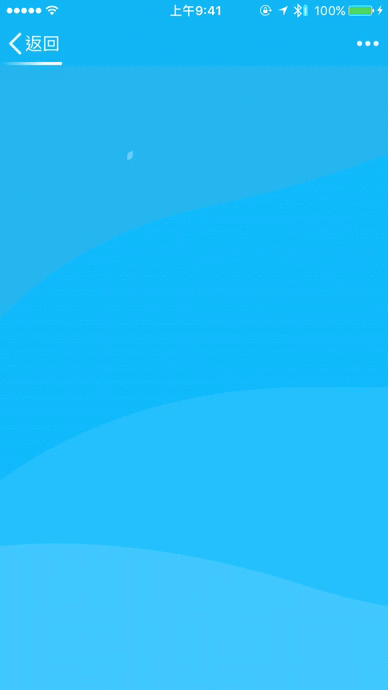
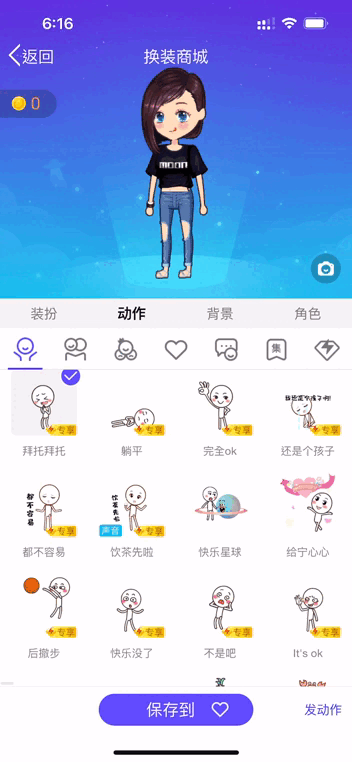
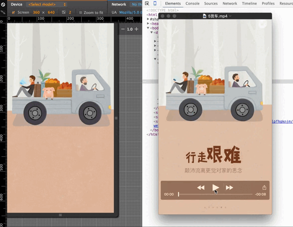
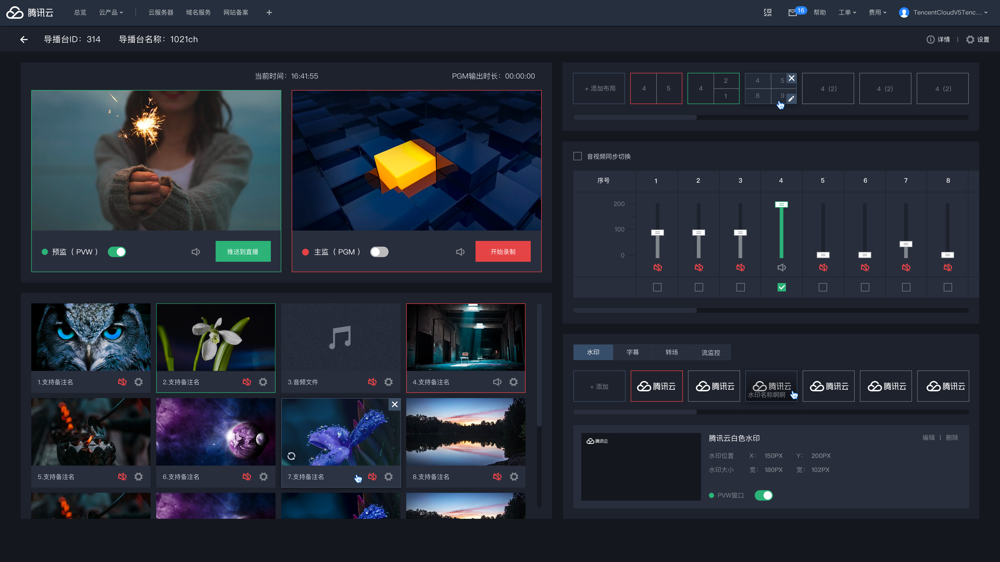
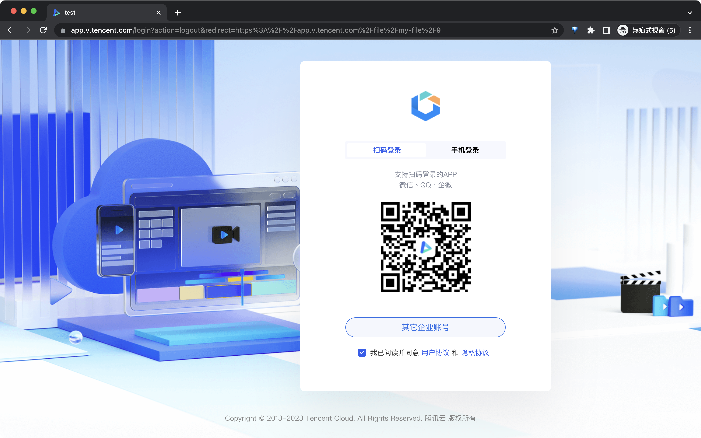
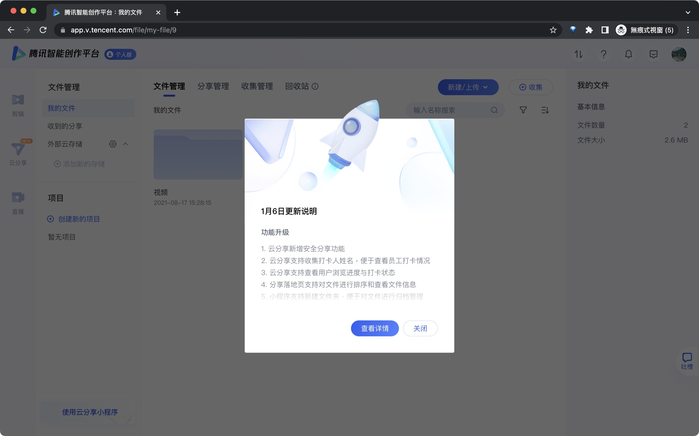
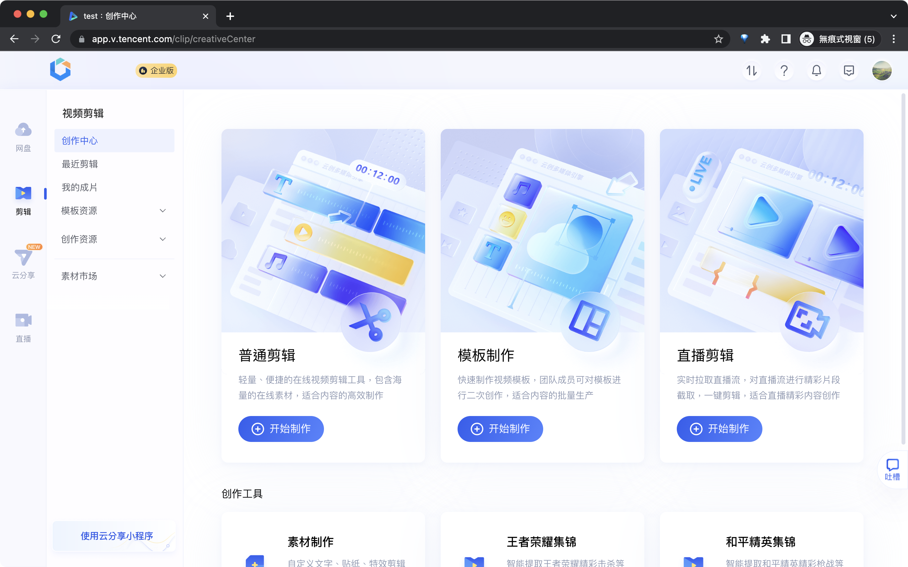
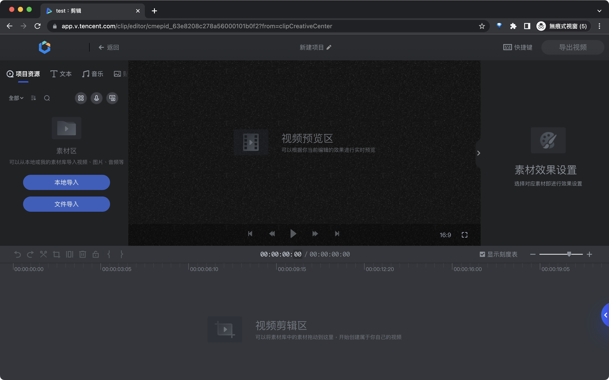
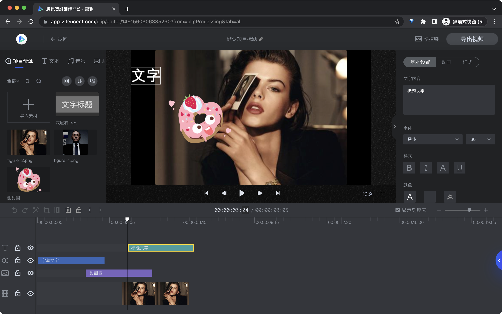
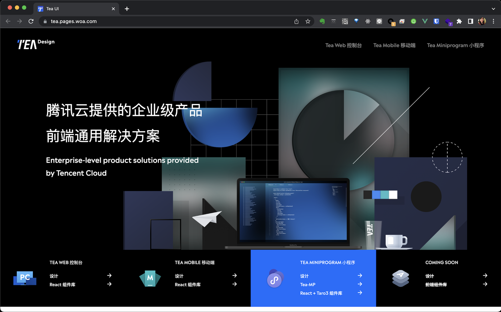

## 用戶體驗設計部（ISUX）

於騰訊 SNG ISUX 擔任前端工程師期間，開發的產品圍繞 QQ 相關應用與 H5 運營頁面

### QQ 運動

    <figure itemprop="associatedMedia" itemscope itemtype="http://schema.org/ImageObject">
        
    </figure>

### 釐米秀

    <figure itemprop="associatedMedia" itemscope itemtype="http://schema.org/ImageObject">
        
    </figure>

### H5 運營頁面

    <figure itemprop="associatedMedia" itemscope itemtype="http://schema.org/ImageObject">
        
    </figure>

## 騰訊雲設計中心（DTC）

於騰訊 CSIG DTC 擔任前端工程師期間，開發的產品圍繞騰訊雲業務相關應用
### 導播台

    <figure itemprop="associatedMedia" itemscope itemtype="http://schema.org/ImageObject">
        
    </figure>

### 騰訊智能創作平台

    <figure itemprop="associatedMedia" itemscope itemtype="http://schema.org/ImageObject">
        
    </figure>
    <figure itemprop="associatedMedia" itemscope itemtype="http://schema.org/ImageObject">
        
    </figure>
    <figure itemprop="associatedMedia" itemscope itemtype="http://schema.org/ImageObject">
        
    </figure>
    <figure itemprop="associatedMedia" itemscope itemtype="http://schema.org/ImageObject">
        
    </figure>
    <figure itemprop="associatedMedia" itemscope itemtype="http://schema.org/ImageObject">
        
    </figure>



#### 體驗連結

[https://app.v.tencent.com/](https://app.v.tencent.com/)

### Tea Design

    <figure itemprop="associatedMedia" itemscope itemtype="http://schema.org/ImageObject">
        
    </figure>

    <figure itemprop="associatedMedia" itemscope itemtype="http://schema.org/ImageObject">
        
    </figure>
    <figure itemprop="associatedMedia" itemscope itemtype="http://schema.org/ImageObject">
        
    </figure>
    <figure itemprop="associatedMedia" itemscope itemtype="http://schema.org/ImageObject">
        
    </figure>



微信掃 QR code 體驗

